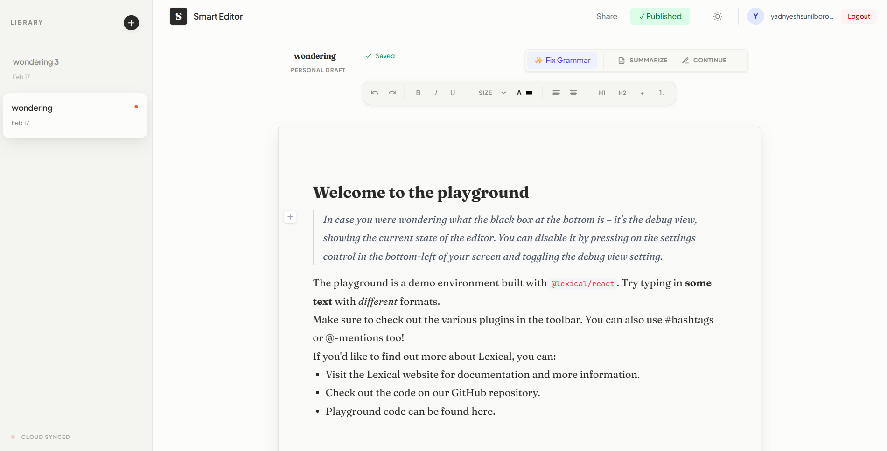
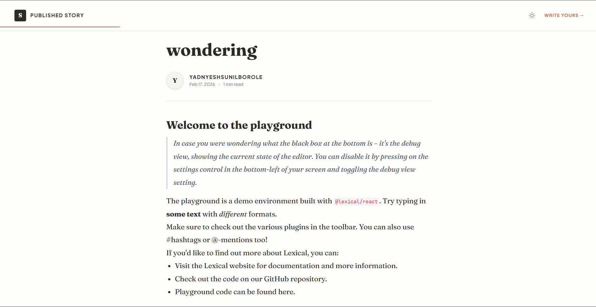

# ✍️ Smart Blog Editor

A full-stack, Notion-style blog editor with **real-time AI writing assistance**, **intelligent auto-save**, and minimalist **"Nordic Editorial"** design. Built as a hiring challenge showcasing **System Architecture**, **State Management**, and **Component Design**.




## ✨ Features

- **✨ Lossless Rich Text** - Headings, Lists, Code Blocks, Quotes (Lexical Editor)
- **🧠 Intelligent Auto-Save** - Debounced sync (1.5s pause detection)
- **🤖 AI Assistant** - Gemini API: Summarize, Continue, Rewrite
- **🔐 JWT Auth** - Secure login/signup + private drafts
- **📱 Nordic Design** - Tailwind CSS + Framer Motion
- **🌐 Preview Mode** - Read-only published views (`/preview/:id`)
- **⚡ Production-Ready** - MongoDB + FastAPI + Docker

---

## 🧩 Tech Stack

| Layer | Technologies |
|-------|--------------|
| **Frontend** | React 18, Vite, Lexical (Rich Text Editor), Zustand (State Management), Tailwind CSS (Styling) |
| **Backend** | FastAPI, MongoDB, Pydantic v2, JWT Authentication |
| **AI Integration** | Google Gemini Pro API |
| **Deployment** | Vercel (Frontend + Backend) |

---

## 🚀 Quick Start

### 1. Clone & Install
```bash
git clone <your-repo-url>
cd smart-blog-editor
```

### Backend (FastAPI)
```bash
 cd backend
python -m venv venv
source venv/bin/activate  # Windows: .\venv\Scripts\activate
pip install -r requirements.txt

cp .env.example .env
# Edit .env: DATABASE_URL, JWT_SECRET, GEMINI_API_KEY

 ```
## Environment Variables:
Create a .env file in the backend/ directory:
```bash 
DATABASE_URL=mongodb+srv://<username>:<password>@cluster.mongodb.net/
JWT_SECRET=your_super_secret_jwt_key
GEMINI_API_KEY=your_google_gemini_api_key
FRONTEND_URL=http://localhost:5173

```
## Run the Server:
``` bash 
uvicorn app.main:app --reload
# API will be available at http://localhost:8000
 ```

### Frontend (React + Vite + Tailwindcss)
``` bash 
cd ../client
npm install
cp .env.example .env.local
# Edit .env.local: VITE_API_URL=http://localhost:8000

 ```
## Environment Variables:
Create a .env file in the Frontend/ directory:
```bash 
VITE_API_URL=http://localhost:8000

```
## Run the Server:
``` bash 
npm run dev
 ```

## 🌐 Access:

**Frontend**: http://localhost:5173

**API**: http://localhost:8000/

**API Docs**: http://localhost:8000/docs

## 🧠 Auto-Save Algorithm (DSA Focus)

To prevent unnecessary API calls, the editor uses a **custom debounce-based Auto-Save Algorithm**:

### 🔧 Core Logic (Pseudocode)

## 🧠 Auto-Save Hook (Debounce + Ownership Check)

This project uses a production-grade **Auto-Save Algorithm** to ensure smooth editing while preventing API spam and unauthorized updates.

### ⭐ Key Features
- Debounced saves (prevents API spam)
- Secure: guests cannot auto-save
- Real-time sync status (`UNSAVED → SAVING → SAVED`)
- Sidebar list auto-updates with latest content
- Optimized for Lexical Editor + Zustand

---

### 🔧 Auto-Save Algorithm (DSA Friendly)

- Uses **debounce** to delay saving until user stops typing  
- Timer resets on every keystroke  
- Only the final stable state is saved  
- `isOwner` check ensures only document owners can save  
- API call + UI updates + sidebar sync  
- **Instant Hydration:** Every keystroke updates the global `editorState` in Zustand via Lexical’s `OnChangePlugin`—fast, responsive, no blocking.
- **Smart Timer:** `useAutoSave` resets a **1.5s debounce timer** on every change.
- **API Trigger:** When the user stops typing for **1500ms**, it fires a `PATCH /api/posts/{id}` request.
- **Memory Safe:** All timers are cleaned up on unmount using `useEffect` cleanup—no leaks, no stale timers.
---

### 🧩 Hook Code (`useAutoSave.ts`)

```ts
import { useEffect, useRef } from 'react';
import { useEditorStore } from '@stores';
import { postService } from '@api/services/postService';

export function useAutoSave(lexicalStateJSON: string, documentId: string, delay = 2000) {
  const { setSyncStatus, isOwner, syncDraftInList } = useEditorStore();

  const timeoutRef = useRef<ReturnType<typeof setTimeout> | null>(null);
  const isInitialMount = useRef(true);

  useEffect(() => {
    // Skip save on first render
    if (isInitialMount.current) {
      isInitialMount.current = false;
      return;
    }

    // Security + guard clauses
    if (!documentId || !lexicalStateJSON || lexicalStateJSON === '{}' || !isOwner) return;

    // Mark document as "Unsaved"
    setSyncStatus('UNSAVED');

    // Debounce logic: reset timer
    if (timeoutRef.current) clearTimeout(timeoutRef.current);

    timeoutRef.current = setTimeout(async () => {
      setSyncStatus('SAVING');

      try {
        await postService.update(documentId, {
          lexical_state: JSON.parse(lexicalStateJSON)
        });

        setSyncStatus('SAVED');

        syncDraftInList(documentId, {
          content: JSON.parse(lexicalStateJSON),
          updated_at: new Date().toISOString(),
        });

      } catch (error) {
        console.error('Failed to auto-save:', error);
        setSyncStatus('ERROR');
      }
    }, delay);

    return () => {
      if (timeoutRef.current) clearTimeout(timeoutRef.current);
    };
  }, [lexicalStateJSON, documentId, delay, setSyncStatus, isOwner, syncDraftInList]);
}
```
## 🔄 Auto-Save Flow

1. **Keystroke** → Updates Zustand state instantly (UI reflects changes)
2. **State change** → Debounce timer resets (1.5s)
3. **User pauses typing** → `PATCH /api/posts/{id}` is triggered
4. **Component unmount** → All timers are cleared (no memory leaks)
## 🗄️ MongoDB Schema  
Perfect for **Lexical AST persistence**:

```ts
const PostSchema = new mongoose.Schema(
  {
    title: { type: String, required: true },

    // Store Lexical Editor AST as JSON
    content: {
      type: Object,
      required: true,
    },

    // For tracking edits / autosave
    updatedAt: { type: Date, default: Date.now },
  },
  { timestamps: true }
);

export default mongoose.model("Post", PostSchema);
```
## 📦 Why This Database Schema?

The database schema is intentionally simple, flexible, and optimized for the **Smart Blog Editor’s real-time, JSON-driven architecture**.

### ✅ 1. Perfect Fit for Lexical JSON AST
Each blog post stores a **massive, deeply nested AST** from the Lexical editor.  
Using a document structure like:

```json
{
  "title": "My Draft",
  "lexical_state": { ...nested JSON... },
  "status": "DRAFT",
  "author_id": "...",
  "timestamps": { ... }
}


🧩 Example Lexical AST (Stored in MongoDB)
```ts 
{
  "lexical_state": {
    "root": {
      "children": [
        {
          "children": [
            {
              "detail": 0,
              "format": 0,
              "mode": "normal",
              "style": "",
              "text": "Welcome to the playground",
              "type": "text",
              "version": 1
            }
          ],
          "direction": null,
          "format": "",
          "indent": 0,
          "type": "heading",
          "version": 1,
          "tag": "h1"
        },
        {
          "children": [
            {
              "detail": 0,
              "format": 0,
              "mode": "normal",
              "style": "",
              "text": "In case you were wondering what the black box at the bottom is – it's the debug view...",
              "type": "text",
              "version": 1
            }
          ],
          "direction": null,
          "format": "",
          "indent": 0,
          "type": "quote",
          "version": 1
        },
        {
          "children": [
            { "detail": 0, "format": 0, "mode": "normal", "style": "", "text": "The playground is a demo environment built with ", "type": "text", "version": 1 },
            { "detail": 0, "format": 16, "mode": "normal", "style": "", "text": "@lexical/react", "type": "text", "version": 1 },
            { "detail": 0, "format": 0, "mode": "normal", "style": "", "text": ". Try typing in ", "type": "text", "version": 1 },
            { "detail": 0, "format": 1, "mode": "normal", "style": "", "text": "some text", "type": "text", "version": 1 },
            { "detail": 0, "format": 0, "mode": "normal", "style": "", "text": " with ", "type": "text", "version": 1 },
            { "detail": 0, "format": 2, "mode": "normal", "style": "", "text": "different", "type": "text", "version": 1 },
            { "detail": 0, "format": 0, "mode": "normal", "style": "", "text": " formats.", "type": "text", "version": 1 }
          ],
          "direction": null,
          "format": "",
          "indent": 0,
          "type": "paragraph",
          "version": 1
        },
        {
          "children": [
            {
              "detail": 0,
              "format": 0,
              "mode": "normal",
              "style": "",
              "text": "Make sure to check out the various plugins in the toolbar...",
              "type": "text",
              "version": 1
            }
          ],
          "direction": null,
          "format": "",
          "indent": 0,
          "type": "paragraph",
          "version": 1
        }
      ],
      "direction": "ltr",
      "format": "",
      "indent": 0,
      "type": "root",
      "version": 1
    }
  }
}
```
**Why MongoDB?** 

✅ Native BSON = Zero serialization

✅ Schema evolution for new nodes

✅ No SQL migration hell

### 📋 API Routes
| Method | Endpoint            | Auth | Description       |
| ------ | ------------------- | ---- | ----------------- |
| POST   | /auth/register      | -    | Create account    |
| POST   | /auth/login         | -    | Get JWT token     |
| GET    | /posts              | ✅    | List drafts       |
| GET    | /posts/{id}         | ✅    | Load editor state |
| PATCH  | /posts/{id}         | ✅    | Auto-save         |
| POST   | /posts/{id}/ai      | ✅    | Gemini assistance |
| POST   | /posts/{id}/publish | ✅    | Publish post      |
| GET    | /preview/{id}       | -    | Public read-only  |


## 📁 Project Structure
Below is a **clean, organized, beautifully formatted** README-ready folder structure section.
Everything is wrapped in a **markdown code block** and optimized for clarity.

```markdown
## 📁 Project Folder Structure

A well-organized, production-ready architecture for a **FastAPI + MongoDB backend** and **React + Vite + Tailwind + Lexical frontend**, fully deployed on **Vercel**.

---

## 🖥️ Backend (`backend/`)

backend/
├── app/
│   ├── __init__.py
│   ├── main.py                 # FastAPI entry point + CORS setup
│   ├── config.py               # Environment variables & settings
│   ├── database.py             # MongoDB connection & lifecycle
│   ├── models/                 # Optional DB models (good practice)
│   ├── schemas/                # Pydantic validation models
│   │   ├── __init__.py
│   │   ├── auth.py
│   │   ├── post.py
│   │   └── ai.py
│   ├── services/               # Business logic & database queries
│   │   ├── __init__.py
│   │   ├── post_service.py     # Post CRUD logic
│   │   └── ai_service.py       # Gemini API integration
│   ├── routers/                # FastAPI routes (HTTP layer)
│   │   ├── __init__.py
│   │   ├── auth.py
│   │   ├── posts.py
│   │   └── ai.py
│   └── utils/                  # Shared helpers/utilities
│       ├── __init__.py
│       ├── security.py         # JWT + Bcrypt helpers
│       └── dependencies.py     # get_current_user, get_db
└── requirements.txt

 
---

## 🌐 Frontend (`client/`)
client/
├── public/                     # Static files (icons, robots.txt)
├── src/
│   ├── api/                    # Axios/Fetch instances + interceptors
│   ├── assets/                 # Global images, fonts, CSS
│   ├── components/             # Reusable UI components
│   │   ├── common/             # Atomic-level primitives (Button, Input)
│   │   ├── layout/             # Navbar, Sidebar, Layout shells
│   │   └── ui/                 # Complex shared components
│   ├── features/               # Domain modules (Core app logic)
│   │   ├── auth/               # Login, Signup, hooks
│   │   ├── editor/             # Lexical logic, Slash menu, custom nodes
│   │   └── dashboard/          # Post list, draft cards
│   ├── hooks/                  # Reusable custom hooks
│   ├── pages/                  # Route-level components
│   ├── stores/                 # Zustand global store
│   ├── theme/                  # Tailwind configs + CSS variables
│   ├── utils/                  # Helpers (formatters, validators)
│   ├── App.jsx                 # Router layout
│   └── main.jsx                # App entry point
├── .env.example                # Environment variable template
├── vercel.json                 # Vercel deployment config
└── eslint.config.js            # Lint rules

---

If you'd like, I can also add:

✅ Architecture diagram  
✅ Deployment flow (Vercel)  
✅ Component tree  
✅ API endpoint documentation  
```


## 🎨 UI Design (Tailwind CSS)

The UI is crafted with a clean, modern, **Notion/Medium-inspired** aesthetic, built entirely using **Tailwind CSS + CSS Variables** for maximum customization and visual consistency.

---

### ✨ Highlights


- 🧭 **Minimal, editorial-style layout** — sidebar + main editor
- 🔤 **Inter-like modern typography** for a smooth writing experience
- 🌫️ **Soft shadows & subtle transitions** for a premium, polished feel
- 📱 **Fully responsive** — sidebar collapses on mobile screens
- 🌗 **Dynamic theme support** (Light + Dark modes)
- 🏷️ **Color-coded status badges** (Draft / Published)
- 🧵 **Elegant custom scrollbar** — slim and visible only on hover

---

### 🎨 Visual Style

- 🪵 **Warm, neutral backgrounds** for a calm reading environment
- 🪶 **Soft borders & gentle contrasts**
- 📐 **Notion-like spacing & padding** for readability
- 🧡 **Terracotta-inspired accent color**

